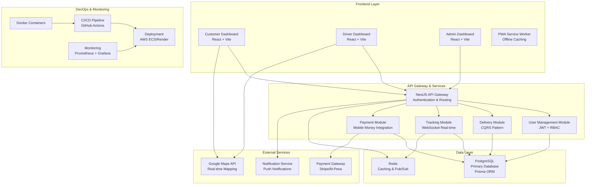

# SNAP System Architecture

## High-Level Overview

SNAP is a last-mile delivery platform designed for scalability, real-time tracking, and mobile-first user experience. The architecture follows a modular, microservices-ready approach with clear separation of concerns.

## System Architecture Diagram

## Architecture Principles

- **Modular Design**: Each module (User, Delivery, Tracking, Payment) is self-contained with clear boundaries.
- **CQRS Pattern**: Command Query Responsibility Segregation for complex business logic in delivery operations.
- **Real-time Communication**: WebSocket integration for live tracking and notifications.
- **Scalability**: Redis for caching, PostgreSQL for persistence, ready for horizontal scaling.
- **Security**: JWT-based authentication with role-based access control.
- **Mobile-First**: PWA capabilities with offline support.

## Data Flow

1. User requests delivery via Customer Dashboard.
2. API Gateway authenticates and routes to Delivery Module.
3. Delivery Module creates request and publishes to Redis Pub/Sub.
4. Driver Dashboard receives notification via WebSocket.
5. Driver accepts assignment, Tracking Module starts GPS session.
6. Real-time updates sent to all stakeholders via WebSocket.
7. Payment processed upon delivery completion.

## Technology Stack

- **Frontend**: React 18, Vite, Tailwind CSS, ShadCN UI, Radix UI, Zustand
- **Backend**: NestJS, PostgreSQL (raw SQL), Redis, Socket.IO
- **Infrastructure**: Docker, AWS ECS, GitHub Actions, Prometheus, Grafana
- **External**: Google Maps API, Payment Gateway APIs

This architecture ensures high availability, performance, and maintainability while supporting the three user types with distinct but interconnected experiences.